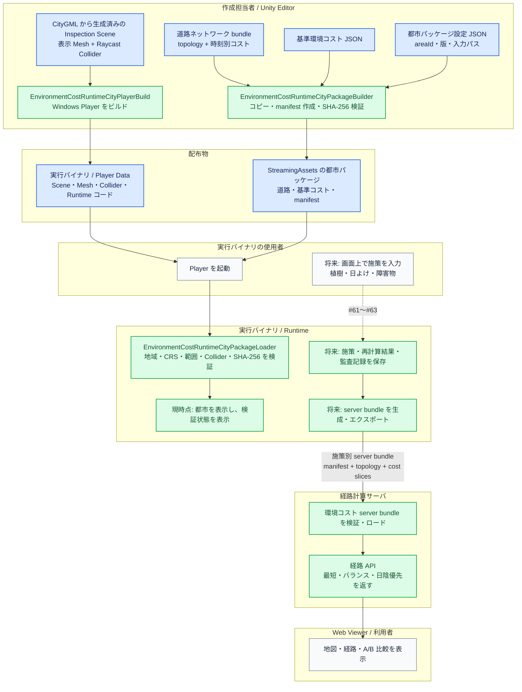

# Runtime 都市データパッケージ

## 目的

Runtime 配布版では Unity Editor、AssetDatabase、PLATEAU SDK のインポータを使わない。都市を開くために必要なデータを、Player 本体と都市ごとのパッケージに分ける。

市ヶ谷の構成定義は [`data/runtime-city-packages/ichigaya-venue.json`](../data/runtime-city-packages/ichigaya-venue.json) である。生成物はローカルの `Assets/StreamingAssets/EnvironmentCostCities/<areaId>/` に置き、容量が大きいため Git には入れない。

| 配布物 | 内容 | 役割 |
| --- | --- | --- |
| Player | 市域の表示 Mesh、Raycast 用 Collider、Runtime 操作コード | 地形・建物・植生を表示し、日射・遮蔽判定の対象にする |
| 都市パッケージ | 道路トポロジー、時刻別道路コスト、基準環境コスト、完全性 manifest | 経路・基準値を Runtime で参照する |

この分離は、描画 Mesh と衝突判定を同じ CityGML 由来 Scene に保持しつつ、容量の大きい道路・コストデータを都市単位で差替え可能にするためのもの。市ヶ谷 Runtime Player が実際に利用するのは、この Player と同じ `areaId` のパッケージの組である。

## 誰が、いつ、何を扱うか

この初期版の Runtime は、**都市の固定データを検証して読み込む基盤**である。都市計画担当者が Runtime 画面で植樹・日よけ・障害物を編集し、再計算する機能は #61〜#64 で追加する。そのため、現時点の実行バイナリの使用者に JSON を記述させることはない。



`EnvironmentCostRuntimeCityPackageLoader` が扱う都市パッケージと、経路計算サーバが扱う server bundle は役割が異なる。前者は Player が都市を安全に開くための入力、後者は経路 API が施策別の経路を返すための入力である。Runtime が出力する施策・再計算結果は、最終的には `environment-cost-server-bundle-1.0` 形式へ変換して経路計算サーバへ配備する。この変換・配備は MVP 後・低優先度の #65 で扱い、#60 はその入力都市データを保証する段階である。

**凡例**

| 色 | 四角が示すもの | 例 |
| --- | --- | --- |
| <span style="display:inline-block;width:1em;height:1em;background:#dbeafe;border:1px solid #2563eb"></span> 青系 | 処理の入出力となるデータまたは配布物 | CityGML 由来 Scene、道路ネットワーク bundle、基準環境コスト、Player、都市パッケージ |
| <span style="display:inline-block;width:1em;height:1em;background:#dcfce7;border:1px solid #16a34a"></span> 緑系 | データを生成、検証、変換、配信する処理 | パッケージ生成、Player ビルド、Runtime 検証、server bundle のロード、経路 API |
| <span style="display:inline-block;width:1em;height:1em;background:#f8fafc;border:1px solid #64748b"></span> 中立色 | 人が行う操作、または処理結果を確認する表示先 | 実行バイナリ使用者、Web Viewer |

### 1. Unity Editor で実行バイナリを生成するときに必要なもの

| 入力 | 用途 | 作成・準備する主体 |
| --- | --- | --- |
| Inspection Scene | CityGML 由来の建物・道路・地形・植生の表示 Mesh と Raycast Collider | 作成担当者。`EnvironmentCostInspectionSceneBuilder` が生成 |
| 都市パッケージ設定 | 地域 ID、版、入力ファイル、出力先を指定 | 作成担当者。市ヶ谷は `data/runtime-city-packages/ichigaya-venue.json` |
| 道路ネットワーク bundle | 経路のノード・辺と時刻別の日陰／日射コスト | 事前分析処理 |
| 基準環境コスト | 施策を入れる前の道路・地点の環境コスト | 事前分析処理 |
| Unity Editor とライセンス | 都市パッケージ生成と Windows Player ビルド | 作成担当者の PC |

生成手順では、まず `EnvironmentCostRuntimeCityPackageBuilder` が道路 bundle と基準環境コストを `StreamingAssets` 向けにコピーし、ファイル一覧・サイズ・SHA-256 を持つ manifest を作る。次に Player をビルドし、Scene の Mesh・Collider と Runtime コードを実行バイナリ側へ同梱する。生成済みの大容量データは Git へ入れない。

### 2. 実行バイナリを実行するときに必要な情報

配布・配置するものは次の二つであり、`areaId` が一致している必要がある。

| 配置物 | 必須内容 | Runtime が行う確認 |
| --- | --- | --- |
| Player | 実行ファイル、Player Data、CityGML 由来 Scene、表示 Mesh、Raycast Collider | `Building` / `Road` / `Terrain` の必須 Collider が Scene にあるか |
| `StreamingAssets/EnvironmentCostCities/<areaId>/` | `manifest.json`、道路トポロジー、全時刻の道路コスト、基準環境コスト | manifest の `areaId`、平面直角座標系の系番号、中心座標、対象半径、全ファイルのサイズと SHA-256 |

検証に失敗すると、Player は「都市データパッケージを使用できません」という状態を画面と Console に表示する。別都市のパッケージ混入、コピー漏れ、ファイル改変を検出できる。初期版は Windows の `StreamingAssets` 同梱を対象とする。

### 3. 実行バイナリの使用者が入力する情報

**#60 時点では必須入力はない。** 使用者は Player を起動して、都市表示とパッケージ検証結果を確認するだけでよい。内部の道路・地形・建物・基準環境コストを、使用者がファイルや JSON で指定する必要はない。

将来の Runtime 編集では、JSON ではなく画面操作で次の内容を入力する予定である。

| 将来の画面入力 | 目的 | 対応 Issue |
| --- | --- | --- |
| 都市の選択・パッケージ取得 | 対象都市を切り替える | #61 |
| 植樹・日よけ・障害物の位置、形状、属性 | 施策案を作る | #62 |
| 再計算の開始・中断 | 施策の影響を計算する | #63 |
| 比較対象となる施策案の選択 | 現状と複数案を比較する | #64 |

### 4. 実行バイナリが生成するデータ

**#60 時点**で永続的に生成するのは、ロード可否とエラー理由を Console／画面に出す状態だけである。都市パッケージ自体はビルド担当者が生成する配布データであり、Runtime の使用者が生成・上書きするものではない。

**#61〜#64 完了後**は、次のデータを Runtime 側で保存する設計にする。元の基準データを上書きせず、入力と結果を監査可能な別データとして扱う。施策シナリオと再計算結果を経路計算サーバ用の `environment-cost-server-bundle-1.0` へ変換して配備する直接連携は、MVP 後・低優先度の #65 で扱う。

| Runtime が保存する予定のデータ | 内容 |
| --- | --- |
| 施策シナリオ | 植樹・日よけ・障害物の入力値、作成者、日時、対象 `areaId`、元パッケージ版 |
| 再計算結果 | 影響範囲、進捗、成功／中断／失敗、生成時刻、入力・出力 fingerprint |
| A/B 比較結果 | 基準案と比較案の指定、経路・日陰率・環境コストの差分 |
| 監査記録 | 使用した都市パッケージ manifest、検証結果、計算条件 |
| 経路計算サーバ用 bundle | 施策別の manifest、道路 topology、時刻別 cost slices。サーバの `ROUTE_SCENARIO_BUNDLES` から参照する |

## 生成

Unity Hub と Editor を完全に終了してから、プロジェクトのルートで次を実行する。

```powershell
$unity = 'C:\Program Files\Unity\Hub\Editor\6000.3.18f1\Editor\Unity.exe'
& $unity -batchmode -quit -nographics `
  -projectPath 'tools\plateau-environment-cost-analyzer' `
  -executeMethod EnvironmentCostRuntimeCityPackageBuilder.Run `
  -runtimeCityPackageConfig 'data\runtime-city-packages\ichigaya-venue.json' `
  -logFile 'tools\plateau-environment-cost-analyzer\Logs\runtime-city-package-ichigaya.log'
```

成功時には `ENVIRONMENT_COST_RUNTIME_CITY_PACKAGE_READY` が出力される。ビルダーは一時ディレクトリに全ファイルをコピーし、SHA-256 とバイト数を検証してから既存パッケージを置き換える。

## manifest と検証

`manifest.json` には次を格納する。

- `areaId`、版、平面直角座標系の系番号、中心座標、対象半径
- 使用する検証 Scene の Asset パス
- 基準環境コストと道路バンドルの入力 SHA-256
- パッケージ全ファイルの相対パス、サイズ、SHA-256
- 必須の `Building`、`Road`、`Terrain` レイヤーと用途

Runtime 起動時の `EnvironmentCostRuntimeCityPackageLoader` は manifest、全ファイルのサイズ・SHA-256、Scene とパッケージの地域・座標系・範囲、必須 Collider レイヤーを検証する。欠落、改変、版・範囲不一致なら状態オーバーレイと Console に理由を表示し、以後の編集・再計算の開始点として利用しない。

## Runtime 日陰解析コア（#61）

### Runtime の範囲の扱い

Runtime では次の三つを混同しない。

- **解析範囲**: 分析設定の中心・半径で、元データの取得と基準環境コスト計算を限定する条件。広域都市データの外形や編集可能領域ではない。
- **配置可能範囲**: Player で `Road` または `Terrain` レイヤーの Collider にレイキャストが当たり、かつ配置物が生成済み道路ネットワークの少なくとも一辺へ日陰影響を与え得る範囲。固定半径だけで拒否しない。
- **出力範囲**: `runtime-shade-input.json` に収録された道路辺のうち、解析範囲に交差する辺。Runtime の再計算・保存結果はこの道路ネットワークに対してのみ生成する。

したがって、都市表示や地表が広くても、道路ネットワーク出力に含まれない地点の施策は保存・配置できない。この場合は、対象地点を含む分析設定で道路ネットワークと基準環境コストを再生成する。

都市パッケージ生成時には `runtime-shade-input.json` も作成する。これは道路辺を Scene と同じローカル座標へ変換した解析入力であり、Runtime は PLATEAU SDK の座標変換や Editor API に依存せずに利用する。

Player 起動後、都市パッケージ検証が完了すると画面に **Runtime Shade Analysis** が表示される。時刻を選び **Run full-road analysis for selected hour** を押すと、全道路辺について次を実行する。

1. `Road` レイヤーへ下向き Raycast を行い、歩行可能な地表を取得する。
2. 歩行者高を加えた地点から太陽方向に `Building` レイヤーへ Raycast を行い、遮蔽を判定する。
3. 道路ごとの日陰率、日射曝露時間、`available` / `partial` / `missing` をメモリ上の結果 DTO として返す。

この段階は全道路を同期解析する基準実装である。編集結果の永続保存、進捗・取消、影響範囲だけの再計算は #63 で扱う。操作結果を server bundle として出力・配備する機能は含まない。

## Player の作成と確認

1. 先に Inspection Scene を生成する。Scene Builder は `EnvironmentCostRuntimeCityPackageLoader` をシーンのルートへ付加する（既存のローカル Scene には Player 起動時に自動付加する）。
2. 上記の都市パッケージを生成する。
3. `Assets/Scenes/EnvironmentCostInspection/ichigaya-venue.unity` を開き、`PLATEAU > Environment Cost > Build Inspection Player (Windows)` を実行する。バッチでは `EnvironmentCostRuntimeCityPlayerBuild.Run` と同じ `-runtimeCityPackageConfig` を使う。
4. Player 起動後、ロード完了なら Console に `ENVIRONMENT_COST_RUNTIME_CITY_PACKAGE_READY` が出る。ファイルがない、壊れている、または別都市の Scene と組み合わせた場合は画面左上に失敗理由が表示される。

初期版では `StreamingAssets` に同梱する。配布後の都市追加・更新は、同一の manifest 検証を通るダウンロードキャッシュへ展開する方式を #61 以降で追加する。Addressables はこの初期パッケージに必須ではないため、Editor 専用の Addressables 設定を Runtime の前提にしない。
