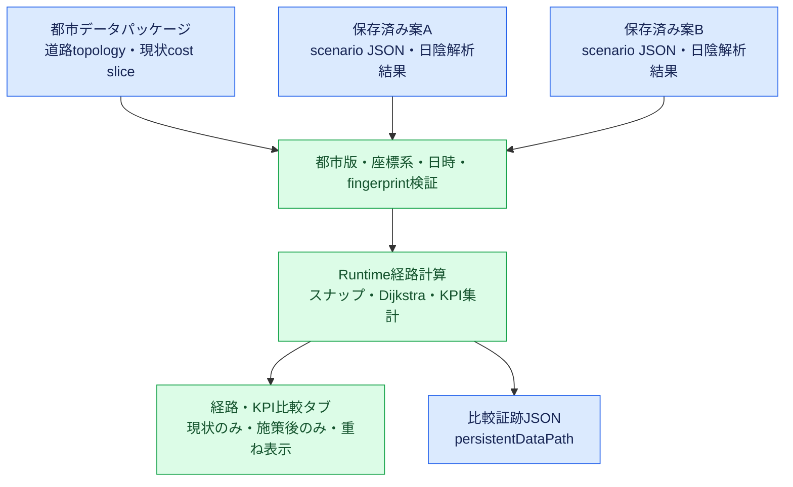

# Runtimeの施策前後経路・KPI比較

## 目的

都市計画担当者がUnity Editorや外部の経路計算サーバーを使わず、Runtime Player内で現状・案A・案Bを同じ条件で比較する。比較対象は、Runtimeで保存し日陰解析を完了した施策シナリオである。

## データフロー



- 青系: 入力または出力データ
- 緑系: Runtime Player内の処理

## 比較条件

起点・終点の道路ノードへのスナップ結果、日時、都市データパッケージ、道路topology、経路プロファイルを全案で固定する。経路探索式と欠測時の扱いは経路サーバーと同じである。

```text
探索重み = 歩行時間 + 日向時間 × 日射回避係数
```

既定プロファイルは次の3種類である。

| 表示 | 日射回避係数 |
| --- | ---: |
| 最短 | 0.0 |
| バランス | 0.5 |
| 日陰優先 | 2.0 |

欠測辺は探索時に全日向と仮定し、その歩行時間を「不明な歩行時間」として別に記録する。日陰率は観測済み区間から計算し、`missing`・`partial`・`available`を表示する。

## 事前準備

案Aと案Bのそれぞれについて、次を行う。

1. 「施策シナリオ」タブで施策を配置し、シナリオを保存する。
2. 「日陰解析」タブで「全時刻を解析」、または比較したい時刻の解析を実行する。
3. 解析完了と証跡パスの表示を確認する。

シナリオJSONと解析結果は、それぞれ次へ保存される。

```text
Application.persistentDataPath/
  EnvironmentCostScenarios/<areaId>/<scenarioId>.json
  EnvironmentCostAnalysis/<areaId>/<scenarioId>/latest.json
```

未保存の編集内容は比較対象にならない。別の都市データ版、異なる座標系、古い施策fingerprint、未解析時刻の結果は比較対象から除外または実行時に拒否される。

## 解析結果 fingerprint の精度保証

### 発生した問題

Runtimeの日陰解析結果は、`shadeRatio` と `solarExposureSeconds` を `double` として保持し、そのIEEE 754ビット列を含めて `resultFingerprintSha256` を計算する。fingerprint は、保存後に結果が変質していないことを確認するための値である。

初期実装では、解析結果の保存と比較時の読込に `UnityEngine.JsonUtility` を使用していた。実データの `18.654066884390497` のような小数を含む約13万道路辺の結果で、保存前の fingerprint、JSON内の fingerprint、およびJSONから独立再計算した値は一致した一方、`JsonUtility.FromJson` 後の再計算だけが不一致となった。

これは単なるJSON文字列から `double` への必然的な丸め誤差ではない。正確なround-tripを行う実装であれば、十分な桁数で出力した `double` の文字列表現は同じIEEE 754ビット列へ復元できる。`JsonUtility` はUnity serializerを内部利用する簡易シリアライザであり、この解析結果に必要な `double` の厳密なround-tripを保証する用途には用いない。

### 対策

解析結果の保存と読込を、同じ `EnvironmentCostRuntimePolicyJson`（Newtonsoft JSON）へ統一した。

- 保存時は `EnvironmentCostRuntimePolicyJson.Serialize(result, Formatting.Indented)` を使用する。
- 比較時は `EnvironmentCostRuntimePolicyJson.Deserialize<EnvironmentCostRuntimeShadeAnalysisResult>(json)` を使用する。
- JSON数値は `FloatParseHandling.Double` と `CultureInfo.InvariantCulture` を明示して読込む。
- 結果fingerprintはJSONテキストそのものではなく、結果DTOの固定順フィールド、UTF-8文字列、整数、`double`/`float` のIEEE 754ビット列をSHA-256へ逐次投入して算出する。`resultFingerprintSha256`自身は対象外とする。
- `JsonUtility` が区別できない `null` と空文字列は、fingerprint上も同じ値として扱う。

このため、pretty/compactのJSON整形差やキー順に依存せず、保存後に同じ解析結果なら同じfingerprintになる。既存のsemantic-v1形式の結果は、Newtonsoftで再読込すれば再解析せずに比較可能である。

### 旧結果と巨大結果の扱い

`resultFingerprintAlgorithm` がない旧結果は、保存・再読込時に高精度 `double` の完全性を安全に検証できないため受理しない。fingerprint が空か否かにかかわらず、対象時刻を再解析して `semantic-v1` 形式へ更新する。比較画面は256 MiBを超える単一 `latest.json` を読み込まない。全時刻の2 GiB級結果は今回の比較対象外とし、比較対象時刻を選んで「選択時刻を解析」を実行して保存する。これにより `File.ReadAllText` によるメモリ不足を防ぐ。

### 回帰テスト

`HourlyEnvironmentCostSelfTests.Run` は、`shadeRatio = 0.6180339887498949` と `solarExposureSeconds = 18.654066884390497` を含む結果について、Newtonsoftの保存相当の直列化・読込後もfingerprintが一致することを確認する。さらに値を1件だけ変更した場合はfingerprintが変化することを確認する。

## 操作手順

1. 「経路・KPI比較」タブを開く。
2. 「解析結果を再読込」を押す。
3. 案Aを選び、必要なら異なる案Bを選ぶ。
4. 比較時刻を選ぶ。
5. 「起点を地図で指定」を押し、道路または地表をクリックする。
6. 同様に終点を指定する。
7. 「同一条件で経路・KPIを比較」を押す。
8. 表示する経路を「最短」「バランス」「日陰優先」から選ぶ。
9. 「現状のみ」「施策後のみ」「重ね表示」を切り替える。案A・案Bの表示も切り替えられる。
10. 距離、歩行時間、日向時間、日陰率、現状との差を確認する。
11. 「比較証跡をエクスポート」を押す。

比較結果欄には、比較時刻・日射回避係数・都市データ版・比較fingerprintに加え、案ごとのscenario ID、全入力施設（ID、種別、ローカル座標、高さ）、解析生成時刻、施策／結果fingerprintを表示する。画面で条件を照合したうえで、同じ内容を含む機械可読な比較証跡を保存できる。

## 表示と差分

- 現状経路: 青
- 案A: 青緑
- 案B: 緑
- 日陰率差: percentage pointで小数3桁まで表示
- 歩行時間差: 0.1秒単位で符号付き表示

差分は丸め前の値から計算する。画面表示が同じ整数パーセントに見える場合でも、小さな差を失わない。

## 比較証跡

出力先は次である。

```text
Application.persistentDataPath/EnvironmentCostComparisons/<areaId>/comparison-YYYYMMDD-HHMMSS.json
```

スキーマは `environment-cost-runtime-route-comparison-0.1` であり、次を含む。

- 都市データ版・manifest SHA-256・topology fingerprint
- 日時、入力起終点、スナップ済みノードと座標、経路プロファイル
- 現状・案A・案BのシナリオIDとpolicy fingerprint
- 案A・案Bの施設入力
- 全経路の辺ID、WGS84座標列、丸め前KPI、欠測状態
- 証跡全体のSHA-256 fingerprint

JSON Schemaは [`schemas/environment-cost-runtime-route-comparison-0.1.schema.json`](../schemas/environment-cost-runtime-route-comparison-0.1.schema.json) に置く。

## 実装境界

Runtimeは都市パッケージに同梱済みのtopologyとcost sliceを読み、pure C#のDijkstraで計算する。外部サーバーへ施策bundleを送信しない。Runtime出力を経路サーバーへ安全に配備する機能は#65の対象である。

経路サーバーとの一致は `data/fixtures/route-server-bundle-v1` を使う `HourlyEnvironmentCostSelfTests.Run` で検証する。
